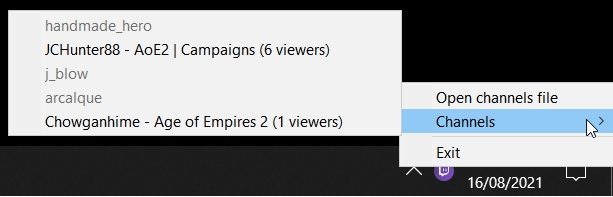

# Taskbar Twitch

Windows-only program that stays in the system tray, it will emit a notification every time a channel goes live.

Channels can be added by editing a configuration file (which you can find available as a shortcut by right-clicking the icon).

In the tray menu you can also check the current status of the channels - if they are live the current title and view count will appear.

After opening a channel using the tray icon, the video player (provided by either the flags or the configuration file) will be opened and the stream will start playing.

### Usage

First you should head to the [Twitch Developers Console](https://dev.twitch.tv/console) page and get a Client ID and Secret Token.

Now you can copy the provided `config.json.example` to `config.json` (the default name for the configuration file) and set the matching fields to the client ID and secret token.
You should also change the channel list to match the ones you are interested in (and the video player application that will be used to open the stream).

### Configuration

#### Flags

* **-c**, **--client**: Twitch Client ID
* **-s**, **--secret**: Twitch Secret Token
* **-p**, **--player**: The video player the app will use to open streams (available players are listed below)
* **-f**, **--file**: Path to the config file (config.json) by default
* **-u**, **--channels**: A list of the channels (comma separated) (e.g. `--channels=j_blow,museun,handmade_hero`)

These flags take precedence over the options set in the configuration file.

#### Players

The supported players are:

* Browser
* mpv (TODO)
* Streamlink (TODO)
